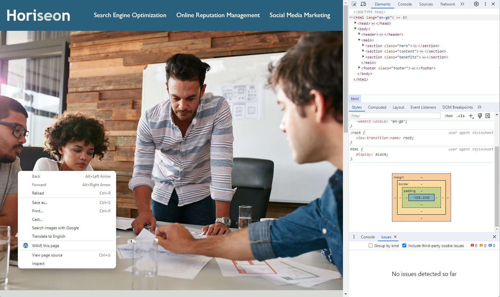

# marketing-code-refactoring

## Description

The aim of this project is to make the website more accessible and clean up the html and css.

I have refractored the html and css, added semantic elements and commented the css.

The website is now accessible via the use of a screen reader and the code is ordered and easy to read.

## Installation

NA

## Usage

This website can be accessed as normal or with the use of a screenreader such as [JAWS](https://www.freedomscientific.com/products/software/jaws/). The code can be accessed via DevTools by pressing Command+Option+I (macOS) or Control+Shift+I (Windows), or right click your mouse and left click _inspect_ as per the screenshot below.

    
## Credits

[w3schools](https://www.w3schools.com/html/default.asp)

[MDN Web Docs](https://developer.mozilla.org/en-US/docs/Learn/HTML)

[stack overflow](https://stackoverflow.com/)

[Shields.io](https://shields.io/badges)

## License

MIT License

Copyright (c) 2023 Andrew Sinkinson

Permission is hereby granted, free of charge, to any person obtaining a copy of this software and associated documentation files (the “Software”), to deal in the Software without restriction, including without limitation the rights to use, copy, modify, merge, publish, distribute, sublicense, and/or sell copies of the Software, and to permit persons to whom the Software is furnished to do so, subject to the following conditions:

The above copyright notice and this permission notice shall be included in all copies or substantial portions of the Software.

THE SOFTWARE IS PROVIDED “AS IS”, WITHOUT WARRANTY OF ANY KIND, EXPRESS OR IMPLIED, INCLUDING BUT NOT LIMITED TO THE WARRANTIES OF MERCHANTABILITY, FITNESS FOR A PARTICULAR PURPOSE AND NONINFRINGEMENT. IN NO EVENT SHALL THE AUTHORS OR COPYRIGHT HOLDERS BE LIABLE FOR ANY CLAIM, DAMAGES OR OTHER LIABILITY, WHETHER IN AN ACTION OF CONTRACT, TORT OR OTHERWISE, ARISING FROM, OUT OF OR IN CONNECTION WITH THE SOFTWARE OR THE USE OR OTHER DEALINGS IN THE SOFTWARE.

## Badges

